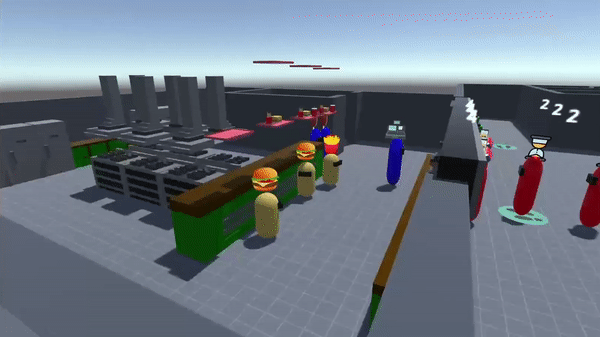
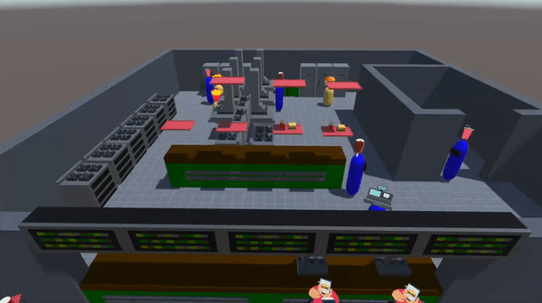

<!-- LICENSE -->

  [![MIT License][license-shield]][license-url]

<!-- What is your project about??? -->
# About The Project
In this repository you can find the final project of the subject "Artificial Intelligence for videogames" of the Complutense University of Madrid. The aim of this project is to simulate a fast food restaurant in the Unity engine. In this restaurant there will coexist 3 types of agents: customers, cashiers and cooks, whose AI will be programmed using the behaviour trees provided by the "Behaviour Designer" extension.

 
 
   

[![C#][C#.com]][C#-url]
[![Unity][Unity.com]][Unity-url]

# The Restaurant
The restaurant has 4 different products, which are: hamburgers, fries, drinks and ice creams. Customers can vary their orders by ordering all the products, or just some of them. The preparation of these orders is similar to how it is done in real life, where the cooks start the orders by preparing the most elaborate products (hamburger/fries) and then the cashiers complete them with those that are easier to prepare (drink/ice cream) before giving the completed orders to the customers.

In addition, the restaurant has litter bins where customers can deposit their trays and toilets that can be used if needed. Both of these have a certain number of uses, after which they are blocked and must be fixed by a cashier so that customers can continue using them.

# Clients
The customer's behaviour is that of a person making an ordinary visit to a fast food restaurant:

1) Upon entering the restaurant, they queue until a cashier takes their order.
2) Once they have placed their order, they wait by the counter until it is ready.
3) When the cashier gives them their order, they go to the seating area to eat. In case there are no seats available, they wait for another customer to finish their meal and leave. 
4) When they finish their meal, they go to the litter bin area to leave their trays, in case all the litter bins are blocked, they wait until a cashier fixes them. 
5) In case they ordered a drink, they go to the toilet area. Where, as with the bins, they wait for a cashier to fix them if none are available. 
6) Finally, they leave the restaurant, ending their visit and being eliminated from the simulation.

 
 
   

# Cashiers
Cashiers are responsible for taking customers' orders, finishing orders with products that are easier to prepare (drinks/ice cream) and taking care of bins and toilets for customers to use.  These agents prioritise their tasks in the following order:

1) Deliver finished orders.
2) Take orders from new customers at the counter.
3) Assist with orders requiring drink/ice creams.
4) Empty bins that have been filled.
5) Repair clogged toilets.

If no tasks are available, cashiers will move to the kitchen room to rest.

 
 
   

# Cooks
Cooks are in charge of starting customer orders with products that take longer to prepare (burgers/fries). These agents prioritise the following tasks:

1) Start new orders by preparing burgers and fries if needed.
2) Add these products to the trays that hold customer orders.
3) Notify cashiers when an order does not need any more products from the kitchen
4) See if they can help by preparing something for another order.

Like the cashiers, cooks will move to the kitchen room to rest if no tasks are available. 

 
 
   

<!-- Let everyone know who made this project possible -->
<h2 align="center">
 Contributors 
</h3>

 
  

<!-- MARKDOWN LINKS & IMAGES -->
<!-- https://www.markdownguide.org/basic-syntax/#reference-style-links -->

[license-shield]: https://img.shields.io/github/license/othneildrew/Best-README-Template.svg?style=for-the-badge
[license-url]: https://github.com/othneildrew/Best-README-Template/blob/master/LICENSE.txt
[linkedin-shield]: https://img.shields.io/badge/-LinkedIn-black.svg?style=for-the-badge&logo=linkedin&colorB=555

[C#.com]: https://img.shields.io/badge/c%23-%23239120.svg?style=for-the-badge&logo=c-sharp&logoColor=white
[C#-url]: https://learn.microsoft.com/en-us/dotnet/csharp/

[Unity.com]: https://img.shields.io/badge/unity-%23000000.svg?style=for-the-badge&logo=unity&logoColor=white
[Unity-url]: https://learn.microsoft.com/en-us/dotnet/csharp/

[Java.com]: https://img.shields.io/badge/java-%23ED8B00.svg?style=for-the-badge&logo=openjdk&logoColor=white
[Java-url]: https://www.java.com/en/

[AndroidStudio.com]: https://img.shields.io/badge/Android%20Studio-3DDC84.svg?style=for-the-badge&logo=android-studio&logoColor=white
[AndroidStudio-url]: https://developer.android.com/studio/intro?hl=en

